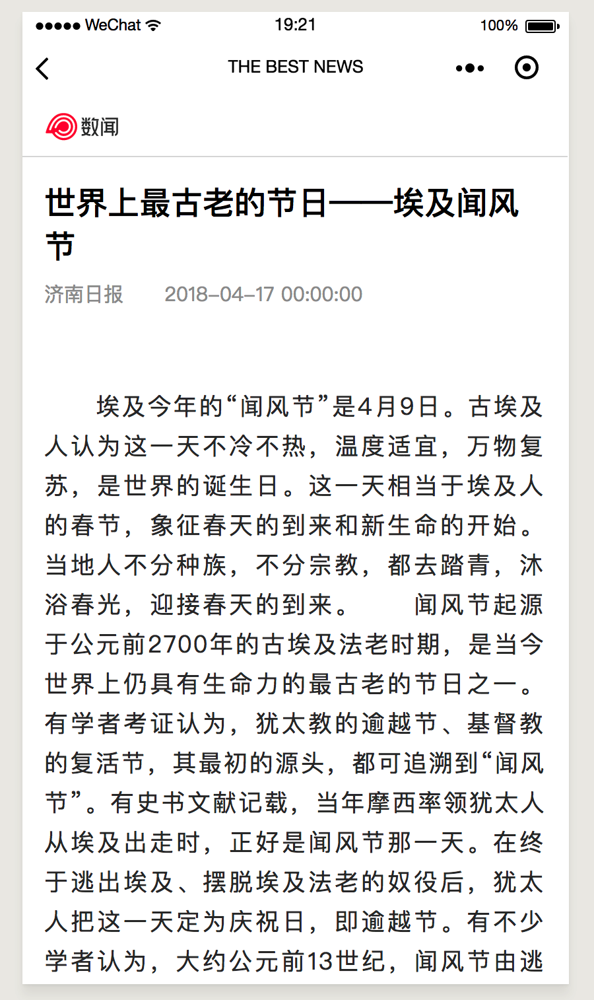
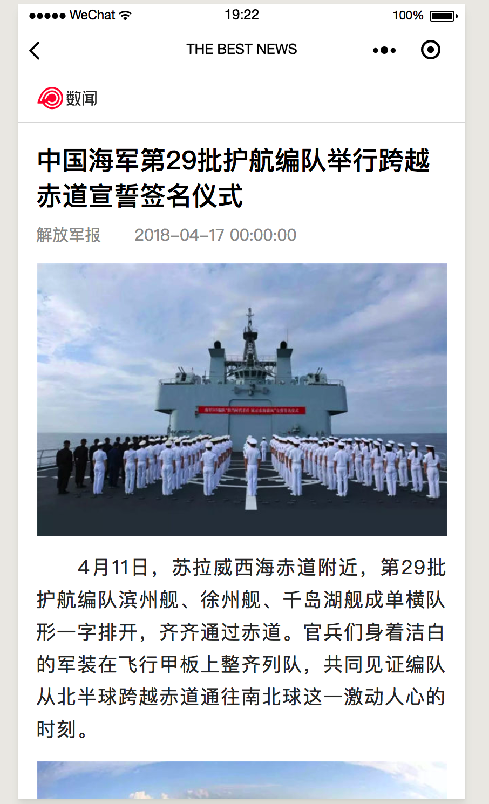
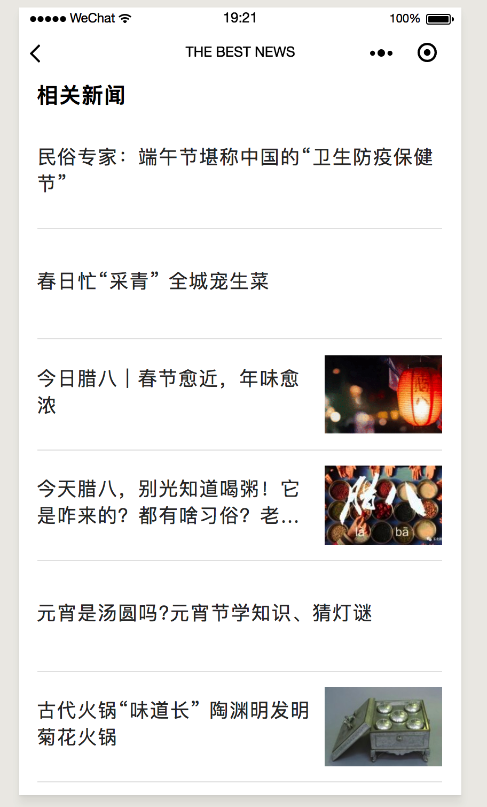
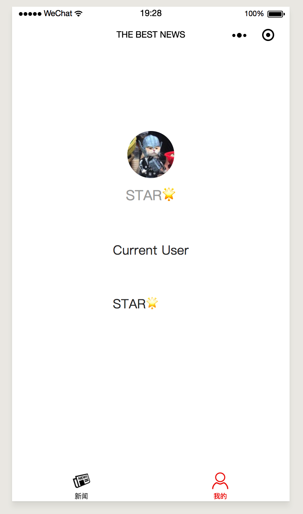

# wechat miniapp- bestnews
新闻阅读微信小程序 

## 说明

1.新闻数据部分API [数闻](https://fenfa.shuwen.com/)

2.新闻html用`web-view`进行解析，在模拟器上可以正常调试，真机调试时小程序必须与**已认证**的服务号或企业号绑定才可以使用

## 界面截图

## TODO

1. 主页热门新闻用轮播图呈现
2. 支持用户自定义选择想看的新闻模块（在用户界面进行选择）
3. 用户界面增添历史记录功能